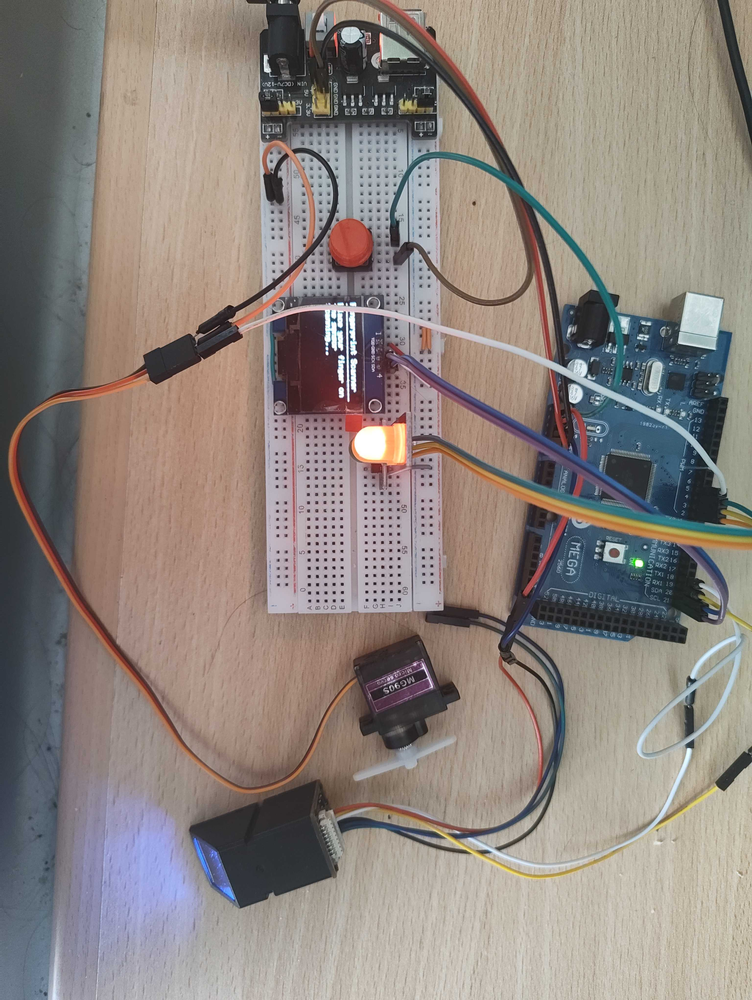

# Fingerprint

## Bill of Materials

* [Arduino Mega](https://store.arduino.cc/products/arduino-mega-2560-rev3)
* JM-101 Fingerprint Sensor (AliExpress or sth)
* SH1106 1.3" 128 x 64 Pixel OLED Display (AliExpress or sth)
* Red, Yellow, and Green LEDs with appropriate resistors
* A servo
* Jumper wires and a breadboard

## How to Use

1. Connect the components according to the wiring diagram below.
2. Upload the code to the Arduino Mega.
3. (Optional) Open the Serial Monitor at 9600 baud.

## Wiring

  <iframe src="https://app.cirkitdesigner.com/project/f00a5960-7620-446b-900b-7fb7076e3451?view=interactive_preview" style="position: absolute; top: 0; left: 0; width: 100%; height: 100%; border: none;"></iframe>

Edit this project interactively in [Cirkit Designer](https://app.cirkitdesigner.com/project/f00a5960-7620-446b-900b-7fb7076e3451).

| Pin on Arduino Mega | Pin on Fingerprint Sensor |
|---------------------|---------------------------|
| 18 (TX1)            | RX                        |
| 19 (RX1)            | TX                        |
| GND                 | GND                       |
| 3.3V                | VCC                       |

| Pin on Arduino Mega | Pin on OLED Display       |
|---------------------|---------------------------|
| 5V                  | VCC                       |
| GND                 | GND                       |
| 21 (SCL)            | SCL                       |
| 20 (SDA)            | SDA                       |

| Pin on Arduino Mega | Pin on LED               |
|---------------------|--------------------------|
| 2                   | Red LED (Anode)          |
| 3                   | Yellow LED (Anode)       |
| 4                   | Green LED (Anode)        |
| GND                 | LED Cathodes             |

| Pin on Arduino Mega | Pin on Servo             |
|---------------------|--------------------------|
| 5                   | Signal (Yellow Wire)     |
| GND                 | GND                      |
| 5V                  | VCC                      |
